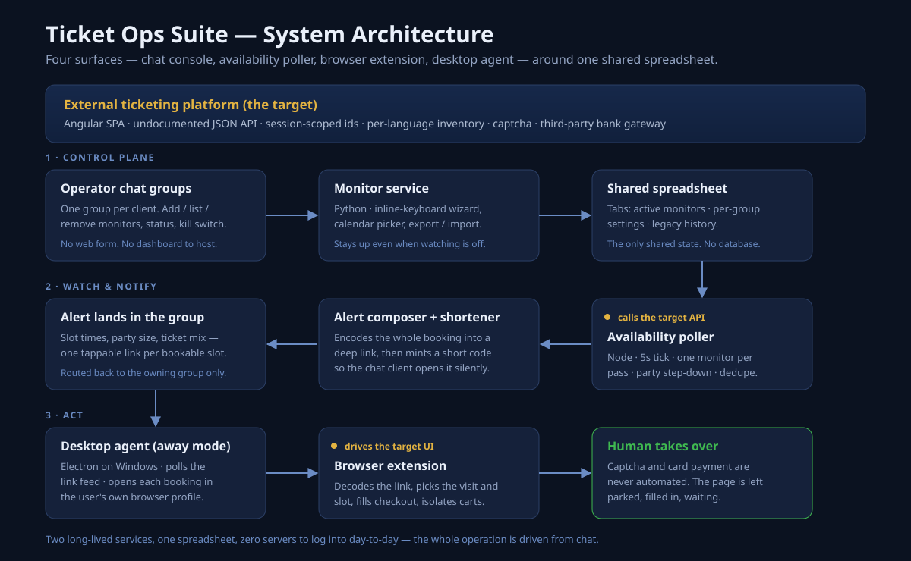
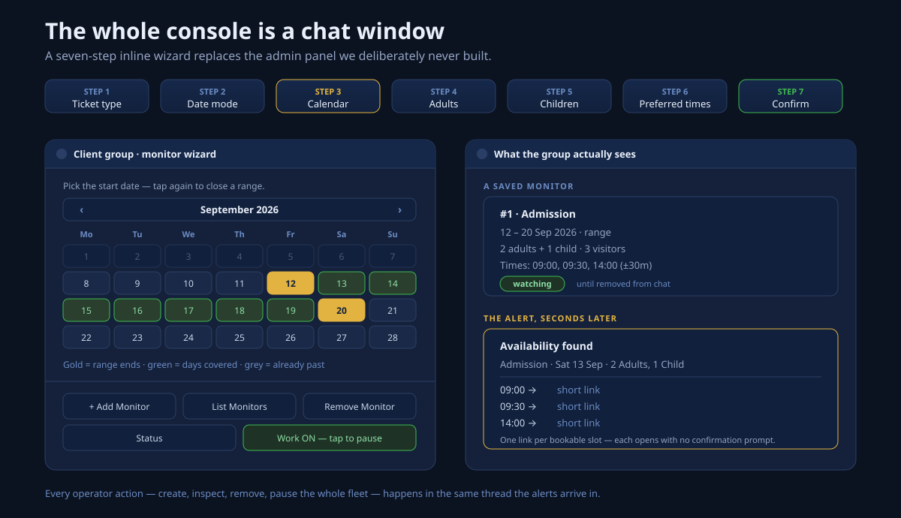
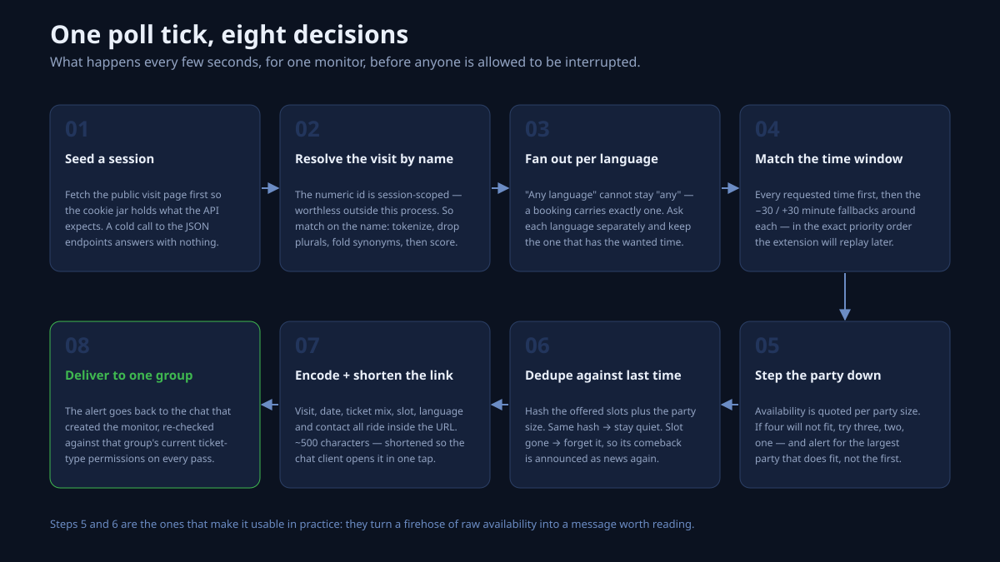
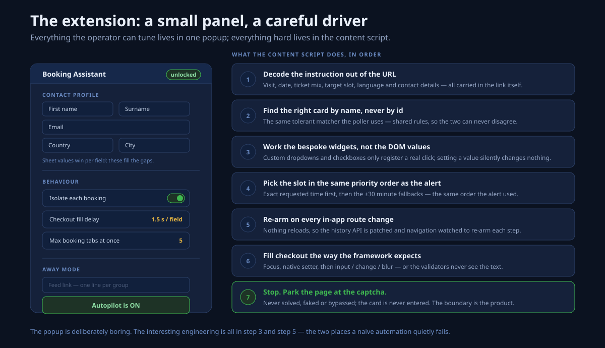
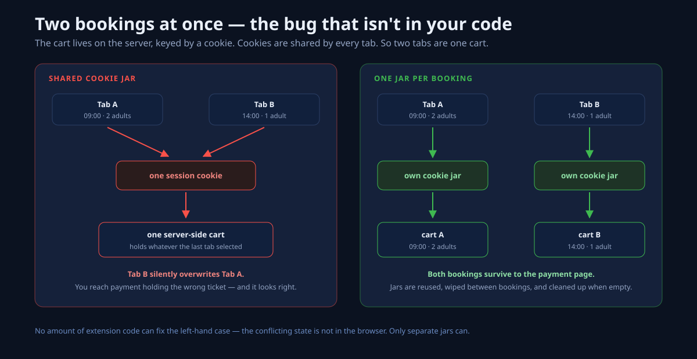
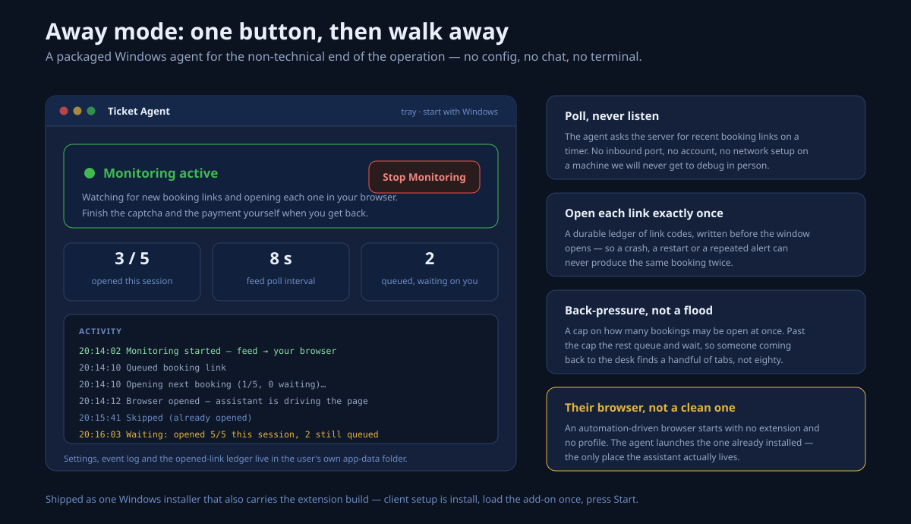
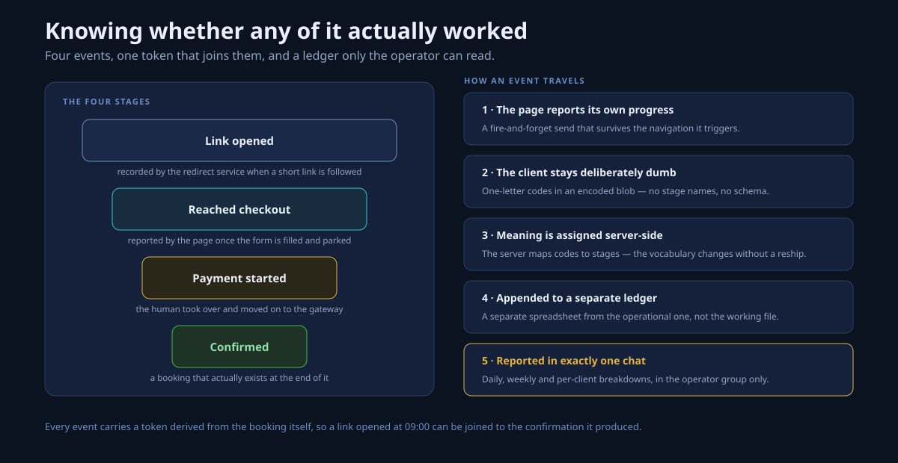
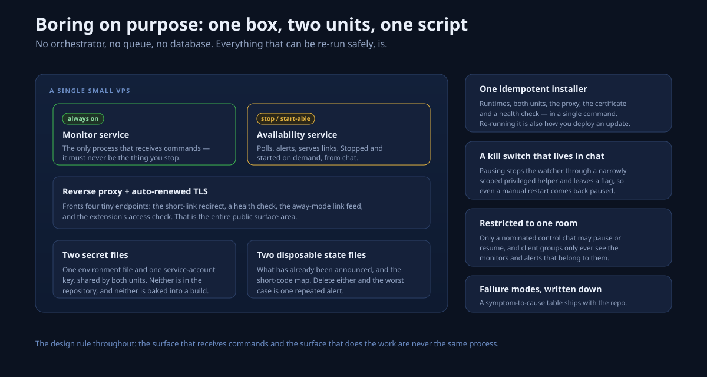

# Ticket Ops Suite — Case Study

A four-surface automation platform for a small booking operation that watches a high-demand
timed-entry ticketing site on behalf of several clients at once.

> All client-identifying detail — the operator, the target platform, domains and credentials —
> is deliberately omitted from this write-up.

---

## TL;DR

| | |
|---|---|
| **Problem** | High-demand timed-entry tickets are released in unpredictable bursts and gone in seconds. The platform has no alerts, quotes availability differently per party size and per tour language, and buries the booking behind a multi-step checkout on a countdown. |
| **Solution** | Four cooperating surfaces: a chat-native console for defining what to watch, a watcher that alerts within seconds with a one-tap link, a browser extension that drives the booking to the payment page, and a desktop agent that does the opening when nobody is at the keyboard. |
| **Hardest part** | Getting a server-side watcher and a client-side extension to agree on which visit, which language and which slot — when the platform's identifiers are session-scoped and its names differ between the API and the page. |
| **Principle** | Automate the tedious 90%. Stop hard at the captcha and the card. |
| **Stack** | Python · Node.js · TypeScript · React · Electron · WXT · Google Sheets API · systemd · nginx |

**At a glance:** 5-second watch interval · 4 shipped surfaces · captcha and payment always manual ·
one idempotent deploy command.

---

## The problem

The platform releases inventory in bursts nobody can predict, and the good slots are gone before a
human notices. There are no notifications, no waitlist, and no API you are meant to use. The only
strategy the site supports is sitting on it and refreshing.

Three details make that worse than it sounds:

- Availability is quoted **per party size** — a slot closed for four may be open for two.
- Guided visits are sold **per tour language**, each with separate inventory.
- Claiming a slot means visit → quantities → time → a long contact form → captcha → an external
  payment gateway, under a countdown, in a page that may not be rendering in your language.

An operator running this for several clients cannot win that race by hand — and also cannot be
handed something that books on their behalf, because the captcha and payment step exist to keep a
person in the loop.

---

## Solution overview

Two long-lived services, one spreadsheet as the only shared state, and two client-side pieces the
operator installs once. No database, no queue, no orchestrator, no admin panel.

The split that matters is between the surface that **receives commands** and the surface that
**does the work**. They are never the same process — which is what makes it safe to stop the
working half at any moment.

---

## Surface 1 — Operator console (chat)

Every operator action happens in a chat thread: a seven-step inline wizard creates a monitor
(ticket type → single date, range or whole month → calendar → adults → children → preferred times →
confirm), and the same thread lists them, removes them, reports status and holds the kill switch.
The alerts arrive in that same thread, so there is nowhere else to go.

Multi-tenancy is just the chat group. Each group sees, edits and is alerted about only its own
monitors — re-checked against that group's *current* permissions on every pass, rather than trusted
from creation time.

---

## Surface 2 — The watcher

A tick every five seconds, one monitor per pass, round-robin so nothing starves. Each pass:

1. **Seed a session** — fetch the public page first; a cold call to the JSON endpoints returns nothing.
2. **Resolve the visit by name** — the numeric id is session-scoped and worthless elsewhere.
3. **Fan out per language** — "any language" cannot stay "any"; a booking carries exactly one.
4. **Match the time window** — requested times first, then ±30 minute fallbacks.
5. **Step the party down** — 4 → 3 → 2 → 1, alerting for the largest party that fits.
6. **Dedupe against last time** — signature over slots + party size.
7. **Encode and shorten the link** — the whole instruction rides in the URL.
8. **Deliver to one group** — the chat that owns the monitor, and only it.

---

## Surface 3 — Browser extension

Tapping an alert opens the real booking site with the instruction encoded in the URL. The extension
decodes it and drives the page the way a fast human would — right visit card, quantities, slot,
contact form — then stops.

Two things make that harder than a form-filler:

- The site's widgets are bespoke. Setting a value changes nothing; only a real click registers, and
  the framework's validators only wake for a specific sequence of native events.
- Navigation happens without a page load, so a content script that runs once never sees checkout.
  The history API is patched and navigation events watched, so each step re-arms at the right moment.

### The concurrency bug

Running two bookings in parallel *appears* to work. But the cart is server-side and keyed by a
cookie, and cookies belong to the profile, not the tab — so the second selection silently overwrites
the first and you check out with the wrong ticket.

There is no client-side fix, because the state being clobbered is not on the client. Each booking
gets its own cookie jar: created on demand, wiped before reuse, cleaned up when its tabs are gone.
Where no per-tab equivalent exists, the feature degrades to a no-op and bookings run one at a time.

---

## Surface 4 — Desktop agent

A Windows installer, one button, a tray icon — for someone running this overnight who should not be
configuring anything. It polls the server for recent booking links and opens each in the browser the
extension is actually installed in (a clean automated browser has neither the extension nor the
saved profile).

The guardrails are the interesting part: links are opened at most once ever, recorded *before* the
window opens; a session cap applies back-pressure so someone returning to the desk finds a handful of
tabs rather than eighty; and it only ever polls outward — no inbound port, no account.

---

## Measurement

Four events — link opened, reached checkout, payment started, confirmed — recorded against a token
derived from the booking itself, so a link tapped at 09:00 can be joined to the confirmation it
produced. The client side stays deliberately dumb (short opaque codes); the server assigns meaning.
The commercial ledger lives in a separate spreadsheet from the operational one.

---

## Operations

One small VPS: two service units, a reverse proxy with an auto-renewed certificate, two secret files
that are in neither the repository nor any build, and two state files whose worst-case loss is one
repeated alert. The public surface is four tiny endpoints.

Deployment is a single idempotent script — runtimes, both units, proxy, certificate, health check —
and re-running it is also how an update ships. Failure modes ship next to it as a symptom-to-cause
table, because the person restarting this at 2am might not be me.

---

## Eight problems that were not obvious from the outside

1. **The identifier that means nothing outside your session.** Passing the platform's numeric visit
   id between the two halves fails intermittently — it is minted per session. Both sides resolve by
   *name* instead, through one shared matcher (tokenize → de-pluralize → fold cross-language
   synonyms → score by overlap), so they cannot drift apart.

2. **"Any language" is not a language.** Asking for "any" merges every language's slots, so the
   watcher finds an 08:00 that exists in only one of them and the link carries none. Each language is
   queried separately, preferring an exact match in one over a near-miss in another.

3. **Availability is quoted per party size.** A slot sold out for four can be open for two. Each pass
   steps the party down and alerts for the largest party that fits, ticket mix clamped, original
   request still shown.

4. **An alert you can still trust on day thirty.** Every alert reduces to a signature over slots +
   party size. Identical signature → silence. Slot disappears → deliberately forgotten, so its return
   is news again. State is pruned against live monitors every pass.

5. **Two tabs, one cart.** See above — fixed with per-booking cookie jars.

6. **Hidden tabs do not run.** Backgrounded tabs have animation frames paused and timers starved, so
   an automation in a hidden tab stalls until clicked. Bookings are processed one at a time in the
   foreground, moving on when one reports it reached checkout, with a watchdog to break the queue.

7. **The process that must never stop.** If pausing stopped the process that receives commands,
   nobody could turn it back on. Console and watcher are separate units; only the watcher stops, via
   a narrowly scoped privileged helper, and pausing drops a flag so a reboot comes back paused.

8. **A 500-character link nobody wants to confirm.** Chat clients open a bare URL immediately but
   interrupt anything else with a confirmation prompt. A tiny redirect service mints a short code
   derived from the link itself, so the same booking always resolves to the same code.

---

## Where it stops

- The captcha is never solved, scored, proxied or bypassed. The page is filled in and left waiting
  for a person.
- Card details are never entered, stored or transmitted. Payment happens on the third-party gateway,
  by hand.
- The extension only acts on a page the operator opened, using details the operator saved.
- Access control on the extension is a server-checked password with a grace window — a real
  deterrent inside an office, and documented as exactly that rather than sold as tamper-proof.
